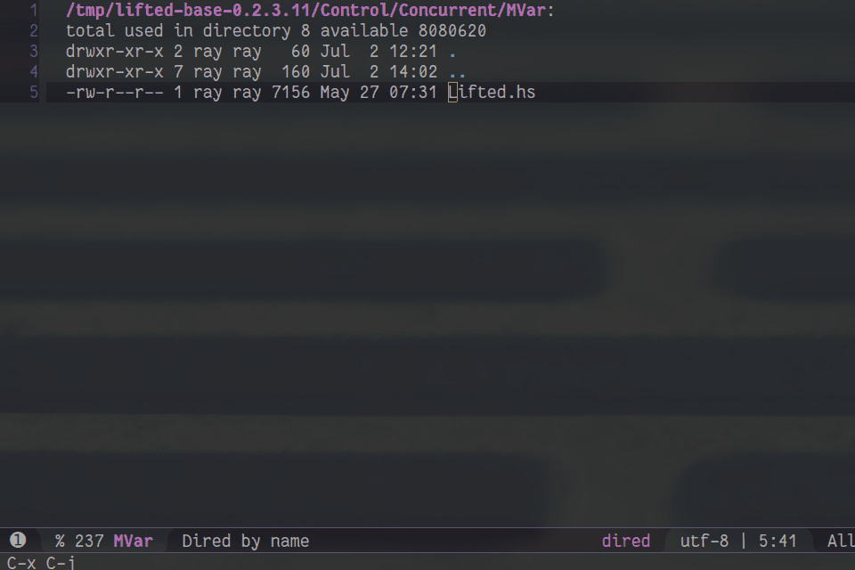

# helm-kythe.el

## Introduction

`helm-kythe.el` is a Helm interface for Google Kythe.

## Requirements

* `emacs >= 25`
* `dash >= 2.12.0`
* `evil >= 1.0`, for jump list
* `helm >= 2.0`

## Usage

`helm-kythe-eldoc-function`: this function will be `add-function` to `eldoc-documentation-function` when `helm-kythe-mode` is enabled. Kythe `snippet` of the definition will be displayed in `minibuffer` when `point` is at a reference.

### Commands

`helm-kythe-mode`: enable `helm-kythe-mode`. You will see `Kythe` in mode line.

`helm-kythe-apply-decorations`: `helm-kythe.el` uses text properties to mark definitions and references. When `helm-kythe-mode` is enabled, this command will be called automatically to fetch cross references information through HTTP API provided by `/opt/kythe/tools/http_server`. Call this command to update text properties in current buffer.

`helm-kythe-find-definitions`

`helm-kythe-find-references`

`helm-kythe-dwim`: find references if at the definition, otherwise find definitions.

`helm-kythe-imenu`: list toplevel definitions in current buffer.

`helm-kythe-resume`: resurrect previously invoked `helm-kythe` command.

`helm-kythe-jump-backward, helm-kythe-jump-forward`: `helm-kythe` maintains a separate jump list (`helm-kythe` jump commands) for each window. The two commands go to the older/newer position in the jump list.

## Suggested key mapping

`helm-kythe-map` is defined for useful commands:

|Key   |Command                                      |
|:-----|:--------------------------------------------|
|`a`   | `helm-kythe-apply-decorations`              |
|`d`   | `helm-kythe-find-definitions`               |
|`i`   | `helm-kythe-imenu`                          |
|`l`   | `helm-kythe-resume`                         |
|`r`   | `helm-kythe-find-references`                |
|`C-d` | `helm-kythe-find-definitions-other-window`  |
|`C-i` | `helm-kythe-jump-forward`                   |
|`C-o` | `helm-kythe-jump-backward`                  |
|`C-r` | `helm-kythe-find-references-other-window`   |

If `helm-kythe-prefix-key` (default: `(kbd "C-c k")`) is not empty, it will be bound to `helm-kythe-map`, thus you can use `C-c k d` for `helm-kythe-find-definitions`.

## Sample configuration

```elisp
(add-hook 'c++-mode-hook 'helm-kythe-mode)
(add-hook 'c-mode-hook 'helm-kythe-mode)
(add-hook 'haskell-mode-hook 'helm-kythe-mode)

(custom-set-variables
 ;; helm-kythe.el talks to /opt/kythe/tools/http_server . This is where http_server listens to.
 '(helm-kythe-http-server-url "http://127.0.0.1:8080")
 ;; If the jump site (`kythe://?path=a/b/c.hs`) cannot be find relative to current project, try `/tmp/haskell-package-root/a/b/c.hs`.
 '(helm-kythe-file-search-paths '("/tmp/haskell-package-root"))
 )
```


